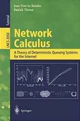

# netcal
 

This is the latest version of the Network Calculus book by Jean-Yves Le Boudec and Patrick Thiran. The  original version is available as [Springer-Verlag Lecture Notes on Computer Science number 2050](https://www.springer.com/en/book/9783540421849).

[Download (pdf)](./latex/netCalBook.pdf)

The source files (latex and images) are also available. You may use them and the pdf under the [Attribution-NonCommercial-Sharealike](http://creativecommons.org/licenses/by-nc-sa/4.0/) license, i.e. you may re-use, re-mix and redistribute for non commercial purposes as long as proper credit is given to the original authors and that a similar license is given to others.

[Other resources on network calculus](https://leboudec.github.io/netcal/)

